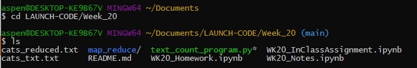
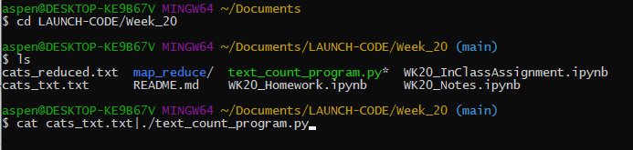
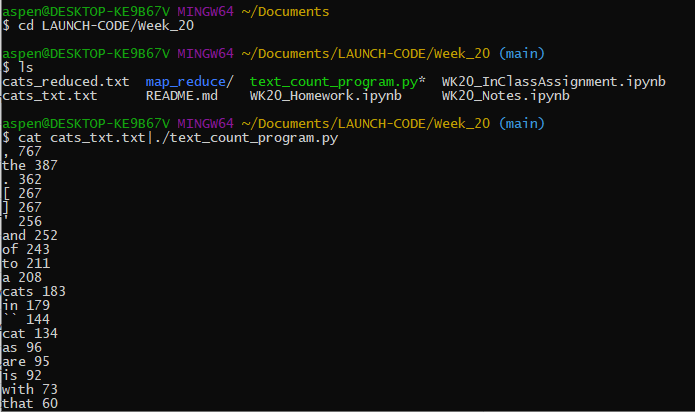

# Week_20
Week 20 - Natural Language Processing

## HW Question 2 - Document how to run the program you created in question 1. Be as clear as possible. Use proper markdown, and consider using screenshots. Be sure to briefly discuss why this kind of exercise might be helpful for NLP in your markdown

The text_count_program.py file can be run in the terminal and accepts a .txt file as input then run the text through a program that does light preprocessing (converting all letters to lower case), word tokenization, frequency counting of tokenized words, and sorting of the frequencies. The result is one line for each word and it's frequency, printed from highest frequency to lowest frequency.

- To run this program in the terminal, first open GitBash and navigate to the folder that houses the text_count_program.py file.

- Once in the correct repo, run the command:
        cat ..\pathway\file_name.txt|./program_name.py
to concatenate the text file and import it into the python program.

- Hit enter and see the results of the tokenize and count program.

Resources Week 20:

for group activity:
https://note.nkmk.me/en/python-check-int-float/
https://www.kite.com/python/answers/how-to-extract-items-from-a-list-in-python

troubleshooting NLTK download issues:
https://stackoverflow.com/questions/38916452/nltk-download-ssl-certificate-verify-failed
https://www.nltk.org/install.html
https://www.nltk.org/data.html

NLTK tokenize documentation:
https://www.nltk.org/api/nltk.tokenize.html

Sorting Counter() by value:
https://stackoverflow.com/questions/20950650/how-to-sort-counter-by-value-python

Cleaning text for Machine Learning:
https://machinelearningmastery.com/clean-text-machine-learning-python/

Vader Sentiment Analysis:
https://www.nltk.org/howto/sentiment.html
https://realpython.com/python-nltk-sentiment-analysis/#using-nltks-pre-trained-sentiment-analyzer

list to string conversion:
https://www.simplilearn.com/tutorials/python-tutorial/list-to-string-in-python#:~:text=To%20convert%20a%20list%20to%20a%20string%2C%20use%20Python%20List,and%20return%20it%20as%20output.

Stemming/Lematization:
https://www.datacamp.com/community/tutorials/stemming-lemmatization-python
https://towardsdatascience.com/stemming-corpus-with-nltk-7a6a6d02d3e5